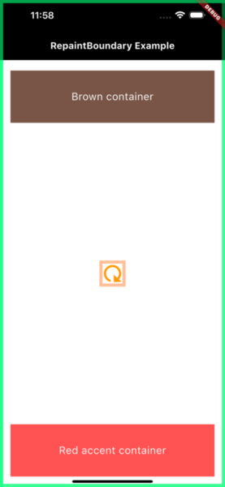

# RepaintBoundary Example

This project serves as an example for an article written on Medium related to the `RepaintBoundary` widget in Flutter. The article demonstrates its use and provides insights into optimizing UI performance in Flutter applications.

### Screenshot
Here is a screenshot from the example application:

## Medium Article
To learn more, check out the article on Medium:  
[When should you actually use a RepaintBoundary?](https://medium.com/@geraldnuraj/when-should-you-actually-use-a-repaintboundary-e81a282602bd)

